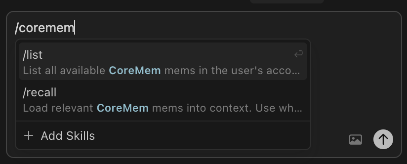

# CoreMem for Cursor

A Cursor plugin that connects your [CoreMem](https://coremem.app) mems to your coding sessions. Relevant context loads automatically, and you can propose updates back to your mem store without leaving the editor.

This plugin uses the [CoreMem MCP server](https://coremem.app/developers?tab=cursor#connect) for all reads and writes.

## How it works

When you install the plugin, Cursor gains access to five MCP tools:

- `list_mems` — see what mems you have
- `get_mem` — read a specific mem
- `search_mems` — find mems by keyword
- `create_mem` — propose a brand-new mem for your review
- `propose_update` — propose a change to an existing mem for your review

Four skills wire those tools into your workflow:

| Skill | How to invoke | What it does |
|---|---|---|
| `recall` | Auto, or `/coremem:recall [query]` | Searches for mems relevant to your current task and loads them |
| `create` | `/coremem:create [name] [content]` | Proposes a new mem — nothing is saved until you approve it |
| `learn` | `/coremem:learn [topic] [content]` | Proposes an update to an existing mem — nothing is applied until you approve it |
| `list` | `/coremem:list [filter]` | Lists all your mems |



`recall` is model-invoked: Cursor decides when to use it. If you are working on something and the agent thinks context from your mems would help, it loads it. You can also call it directly with a query to pull something specific.

`create`, `learn`, and `list` are user-invoked only.

## Requirements

- Cursor (any recent version)
- A CoreMem account with a Pro plan (API key required)

## Setup

Generate an API key at [coremem.app/integrations#mcp](https://coremem.app/integrations#mcp), then set it as an environment variable:

```bash
export COREMEM_API_KEY=your-api-key
```

Then install the plugin via the Cursor marketplace or the command palette.

## Proposals

When you run `/coremem:create` or `/coremem:learn`, it submits a proposal through the MCP server. Nothing changes in your mem store until you review and approve it at [coremem.app](https://coremem.app).
